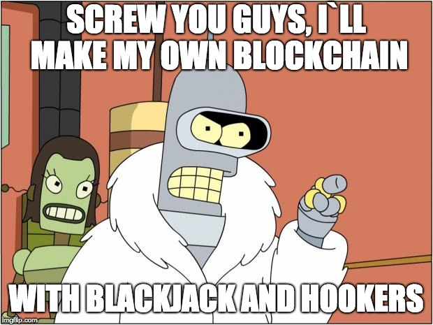

Yet another blockchain, for learning purpose.

## Mining

To start mining random blocks
```bash
bin/mine
```

## Validate

Validate blocks

```bash
bin/validate
```

## Example code

```ruby
@blockchain = RubyCoin::Blockchain.new
@blockchain << { blackjack: true }
@blockchain << { hookers: true }
@blockchain << { test: 3 }
@blockchain << { test: 4 }

pp @blockchain
```

```
#<RubyCoin::Blockchain:0x007ff7e11fcbe8
 @miner=
  #<RubyCoin::Miner:0x007ff7e1203b78
   @difficulty=4,
   @difficulty_prefix="0000",
   @hasher=#<RubyCoin::Hasher:0x007ff7e21aa838>>,
 @storage=
  [#<RubyCoin::Block:0x007ff7e2067728
    @data={:blackjack=>true},
    @difficulty=4,
    @hash="00008c70dfadb0d7ed048a71b17724d0c98f546815826ff18301ea66881771c2",
    @nonce=102467,
    @prev_hash=
     "0000000000000000000000000000000000000000000000000000000000000000",
    @time=2018-05-29 21:35:47 +0200>,
   #<RubyCoin::Block:0x007ff7e196cd88
    @data={:hookers=>true},
    @difficulty=4,
    @hash="00007fc6f00a482590a358c9ff35918f1442c526919d073d1a369d9597d6d7bc",
    @nonce=210072,
    @prev_hash=
     "00008c70dfadb0d7ed048a71b17724d0c98f546815826ff18301ea66881771c2",
    @time=2018-05-29 21:35:48 +0200>,
   #<RubyCoin::Block:0x007ff7e220af30
    @data={:test=>3},
    @difficulty=4,
    @hash="0000eb293bc6b97c606cde108ccb773241832a1a3e38bc08dc7bb4b78b6fef87",
    @nonce=114403,
    @prev_hash=
     "00007fc6f00a482590a358c9ff35918f1442c526919d073d1a369d9597d6d7bc",
    @time=2018-05-29 21:35:50 +0200>,
   #<RubyCoin::Block:0x007ff7e11fc7b0
    @data={:test=>4},
    @difficulty=4,
    @hash="0000f759e3d13574c76f872f4362bde1432768ca56bcb97831ddd5ae42fe93cc",
    @nonce=53342,
    @prev_hash=
     "0000eb293bc6b97c606cde108ccb773241832a1a3e38bc08dc7bb4b78b6fef87",
    @time=2018-05-29 21:35:51 +0200>]>
```

## Reference
* https://github.com/yukimotopress/blockchains
* https://github.com/openblockchains/blockchain.lite.rb
* https://medium.com/programmers-blockchain/create-simple-blockchain-java-tutorial-from-scratch-6eeed3cb03fa
* https://bigishdata.com/2017/10/17/write-your-own-blockchain-part-1-creating-storing-syncing-displaying-mining-and-proving-work/
* https://medium.com/programmers-blockchain/creating-your-first-blockchain-with-java-part-2-transactions-2cdac335e0ce


https://blockchain.info/pl/block/00000000839a8e6886ab5951d76f411475428afc90947ee320161bbf18eb6048
